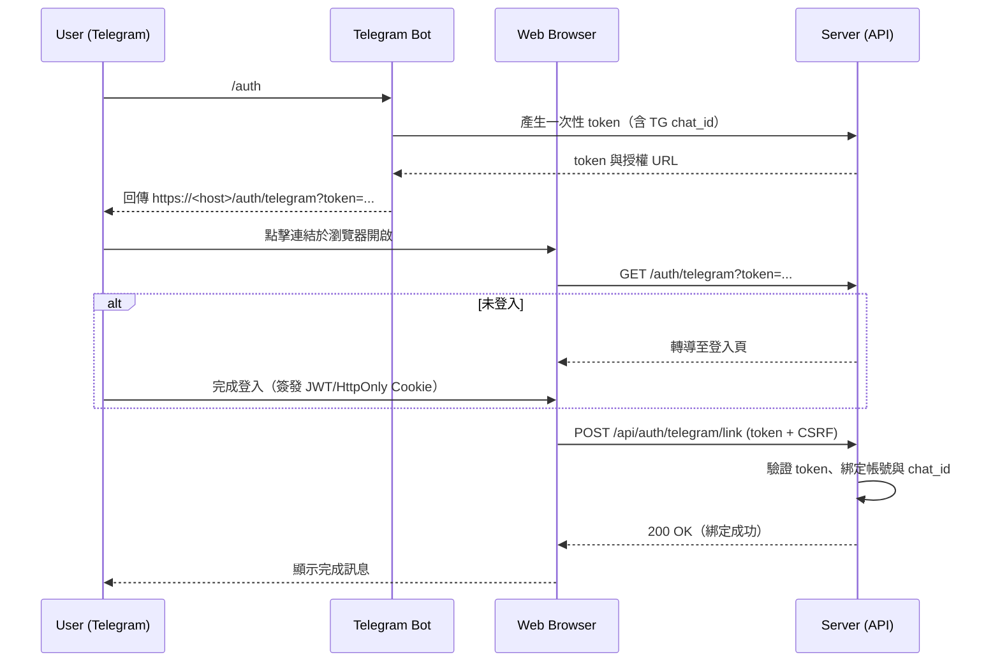

# API 與 Telegram 指令一覽

> 本文件彙整自專案 `structure.md` 與 `README.md`，整理所有需要的 **API Endpoints** 與 **Telegram 命令**，並提供對應關係與流程圖。

---

## 一、API Endpoints 總表

> 備註：本系統採 JWT（建議以 **HttpOnly Cookie** 保存）進行身分驗證；**管理者** 表示需具備 `admin` 角色。

| 方法   | 路徑                      | 簡介                                                               | 是否須驗證             | 輸入（請求） / 輸出（回應）                                                                                                                                                               | 對應的 Telegram 操作                                 |
| ------ | ------------------------- | ------------------------------------------------------------------ | ---------------------- | ----------------------------------------------------------------------------------------------------------------------------------------------------------------------------------------- | ---------------------------------------------------- |
| GET    | `/:short_path`            | 依短碼重定向至原始網址，並**非同步**紀錄點擊資訊（時間、國家、UA） | 否                     | **輸入**：Path 參數 `short_path`。<br>**輸出**：`301/302` Redirect 至 `original_url`。                                                                                                    | 無（使用者直接點連結）                               |
| POST   | `/api/auth/register`      | 使用者註冊                                                         | 否                     | **輸入**：JSON `{ "username": string, "password": string }`。<br>**輸出**：`201`，JSON `{ "id": number, "username": string }`                                                             | 無                                                   |
| POST   | `/api/auth/login`         | 使用者登入並簽發 JWT                                               | 否                     | **輸入**：JSON `{ "username": string, "password": string }`。<br>**輸出**：`200`，Set-Cookie: JWT（HttpOnly）；JSON `{ "username": string, "permissions": int }`                          | 無                                                   |
| GET    | `/auth/telegram`          | Telegram 授權頁（透過 `token` 完成帳號綁定流程的視覺化頁面）       | 否（但頁面動作需登入） | **輸入**：Query `token`（一次性、限時）。<br>**輸出**：HTML 頁面（導向登入／確認綁定）。                                                                                                  | `/auth` 會提供此頁的 URL                             |
| POST   | `/api/auth/telegram/link` | 確認並完成 Telegram 帳號綁定                                       | 是（Web 已登入）       | **輸入**：JSON `{ "token": string }`（並需 CSRF 保護）。<br>**輸出**：`200`，JSON `{ "ok": true }`                                                                                        | `/auth` 綁定流程的最終步驟                           |
| GET    | `/api/urls`               | 取得自己建立的短網址列表                                           | 是                     | **輸入**：無。<br>**輸出**：`200`，JSON `[{ "id": number, "short_path": string, "original_url": string, "total_clicks": number, "created_at": ISO8601 }]`                                 | `/list`（透過 Use Case）                             |
| POST   | `/api/urls`               | 新增短網址（隨機或自訂，依角色規則）                               | 是                     | **輸入**：JSON `{ "original_url": string, "custom_path": string(optional) }`。<br>**輸出**：`201`，JSON `{ "id": number, "short_path": string, "original_url": string }`                  | `/new <original_url> [custom_path]`（透過 Use Case） |
| DELETE | `/api/urls/:id`           | 刪除自己建立的短網址                                               | 是                     | **輸入**：Path 參數 `id`。<br>**輸出**：`204` 無內容                                                                                                                                      | `/delete`（透過 Use Case）                           |
| GET    | `/api/urls/:id/stats`     | 取得指定短網址的統計（時間、國家、系統、瀏覽器）                   | 是                     | **輸入**：Path 參數 `id`；可選 Query：`from`、`to`、`bucket`。<br>**輸出**：`200`，JSON `{ "total": number, "by_time": [...], "by_country": [...], "by_os": [...], "by_browser": [...] }` | `/stats`（透過 Use Case）                            |
| GET    | `/api/admin/urls`         | 取得全系統短網址列表（管理功能）                                   | 管理者                 | **輸入**：可選 Query：分頁／搜尋。<br>**輸出**：`200`，JSON `[{ "id": number, "owner": string, "short_path": string, "original_url": string, "total_clicks": number }]`                   | 無                                                   |
| DELETE | `/api/admin/urls/:id`     | 刪除任一短網址（管理功能）                                         | 管理者                 | **輸入**：Path 參數 `id`。<br>**輸出**：`204` 無內容                                                                                                                                      | 無                                                   |

> 提醒：所有**寫入型**端點（註冊、登入、建立、刪除、綁定）建議配置 **Rate Limiting** 與 **CSRF**（適用於瀏覽器端表單／AJAX），詳見專案安全規劃。

---

## 二、Telegram 命令

| 指令                                | 需求   | 說明                                                            | 交互流程（與 Use Case 的關聯）                                                                                            |
| ----------------------------------- | ------ | --------------------------------------------------------------- | ------------------------------------------------------------------------------------------------------------------------- |
| `/start`                            | 無     | 顯示歡迎訊息與可用指令                                          | 僅 Bot 回覆說明，無直接與後端互動                                                                                         |
| `/auth`                             | 無     | 產生一次性 `token` 並回傳授權 URL（使用者點開在瀏覽器完成綁定） | 生成並回覆 `https://<host>/auth/telegram?token=...`；之後使用者登入後，由頁面觸發 `POST /api/auth/telegram/link` 完成綁定 |
| `/whoami`                           | 已綁定 | 顯示綁定之系統帳號與角色                                        | Bot 端呼叫 `UserUseCase` 的方法 (如 `GetMe`)                                                                              |
| `/new <original_url> [custom_path]` | 已綁定 | 建立短網址（支援隨機或自訂）                                    | Bot 伺服器端以使用者身份呼叫 `URLUseCase` 的方法 (如 `CreateShortURL`)                                                    |
| `/delete <short_path>`              | 已綁定 | 刪除自己建立的短網址                                            | Bot 先查 `short_path -> id`，成功後呼叫 `URLUseCase` 的方法 (如 `DeleteShortURL`)                                         |
| `/list`                             | 已綁定 | 列出自己建立的短網址清單                                        | 呼叫 `URLUseCase` 的方法 (如 `ListByUser`)，以文字清單回傳                                                                |
| `/stats <short_path>`               | 已綁定 | 顯示短網址的總點擊與概況                                        | Bot 先查 `short_path -> id`，再呼叫 `AnalyticsUseCase` 的方法，整理關鍵數字回覆                                           |

---

## 三、Mermaid 圖

### 1) 短網址重定向與點擊紀錄（Flowchart）

```mermaid
flowchart LR
    A[使用者請求 /:short_path] --> B{查詢短碼}
    B -- 找到 --> C[取得 original_url]
    C --> D[擷取 Client IP / User-Agent / Now]
    D --> E[送入 Click Queue (非同步)]
    E -->|背景寫入| F[(url_clicks)]
    C --> G[回應 301/302 Redirect 至 original_url]
    B -- 找不到 --> H[回應 404]
```

### 2) Telegram 綁定授權（Sequence）



---

## 四、回應格式範例（參考）

> 以下為常見回應的簡短示意，實際欄位可依 `sqlc` 與前端需求微調。

```jsonc
// GET /api/urls
[
	{
		"id": 12,
		"short_path": "abc123",
		"original_url": "https://example.com/page",
		"total_clicks": 42,
		"created_at": "2025-08-10T02:30:00Z",
	},
]
```

```jsonc
// GET /api/urls/:id/stats
{
	"total": 42,
	"by_time": [{ "bucketStart": "2025-08-09T00:00:00Z", "count": 10 }],
	"by_country": [{ "key": "TW", "count": 30 }],
	"by_os": [{ "key": "Android", "count": 18 }],
	"by_browser": [{ "key": "Chrome", "count": 20 }],
}
```

---

## 五、權限與安全備註（摘要）

- 一般使用者可建立隨機短碼；自訂前綴需符合 `@username/...`；特殊路徑（`/api/`, `/auth/` 等）保留不可用。
- 管理者可檢視／刪除任何短網址。
- 登入使用 JWT（HttpOnly Cookie）；寫入型 API 建議加上 Rate Limiting 與 CSRF 防護。
- 點擊紀錄不入庫 IP；以 GeoIP 解析國碼後即丟棄原始 IP。
