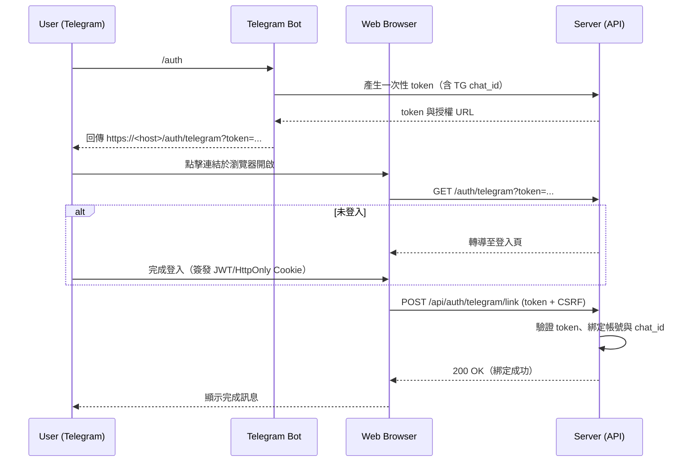

# 短網址系統完整規格書 (Consolidated)

---

## 1. 總覽 (Overview)

本文件旨在定義一個個人化、功能豐富的短網址系統。此系統將使用 Go 語言搭配 Gin 框架進行後端開發，前端則採用 Astro 框架，並以 SQLite 作為後端資料庫，透過 sqlc 工具進行類型安全的資料庫操作。

使用者可以透過 Web 介面或 Telegram Bot 與系統互動，進行短網址的新增與刪除。系統將包含一個基於角色的存取控制（RBAC）機制，以管理不同使用者的操作權限。

## 2. 系統架構 (System Architecture)

本系統將採用**乾淨架構 (Clean Architecture)** 的設計模式，以確保高度的模組化、可測試性與可維護性。架構將分為四個主要層次，並嚴格遵守依賴關係原則（內層永遠不能依賴外層）。

```
+-----------------------------------------------------------------+
|  Presentation (Interface Adapters)                              |
|  +-----------------+   +------------------+   +---------------+ |
|  | Gin Web Server  |   |  Telegram Bot    |   | Astro Frontend| |
|  | (REST & Web UI) |   |  (Commands)      |   | (Embedded)    | |
|  +-------+---------+   +--------+---------+   +---------------+ |
+----------|----------------------|-------------------------------+
           |                      |
           v                      v
+-----------------------------------------------------------------+
|  Application (Use Cases)                                        |
|  +----------------------+  +-----------------------+            |
|  |  URLUseCase          |  |  UserUseCase          |  ...       |
|  | (Create, Delete, Get)|  | (Register, Login)     |            |
|  +----------------------+  +-----------------------+            |
+----------------|------------------------------------------------+
                 |
                 v
+-----------------------------------------------------------------+
|  Domain (Entities)                                              |
|  +-----------------+   +------------------+   +---------------+ |
|  |   ShortURL      |   |      User        |   |     Role      | |
|  +-----------------+   +------------------+   +---------------+ |
+-----------------------------------------------------------------+
                 ^
                 | (Implements Interfaces)
+----------------|------------------------------------------------+
|  Infrastructure (External Concerns)                             |
|  +-----------------+   +------------------+   +---------------+ |
|  | SQLite (sqlc)   |   |  Telegram Client |   |      ...      | |
|  | (Repository)    |   |                  |   |               | |
|  +-----------------+   +------------------+   +---------------+ |
+-----------------------------------------------------------------+

```

1.  **Domain (實體層):** 位於架構的最核心。定義了系統中最核心的業務邏輯與資料結構（實體），例如 `User`, `ShortURL`。此層不依賴任何外部框架或工具。

2.  **Application (應用層):** 包含了系統的應用程式特定業務規則，也就是「使用案例 (Use Cases)」。例如 `CreateShortURLUseCase`。此層會調度 Domain 層的實體來完成具體的業務流程，並定義了與外部基礎設施（如資料庫）溝通的介面（Interface）。

3.  **Infrastructure (基礎設施層):** 負責所有與外部世界的互動，是所有技術細節的實現。這包括資料庫的存取（透過 sqlc 實現 Application 層定義的 Repository 介面）、第三方服務的串接（如 Telegram Bot API）、日誌記錄等。

4.  **Presentation (表現層):** 系統的進入點，負責與使用者或其他系統進行互動。此層包含：
    - **Gin Web Server:** 處理 HTTP 請求，提供 RESTful API 給前端，並提供短網址重定向服務。此層應實作必要的 HTTP 安全標頭 (CSP, HSTS, X-Frame-Options 等)。
    - **Astro Frontend:** 使用 Astro 框架開發的現代化 Web 前端。在開發時獨立運行，但在最終部署時，其靜態檔案會被編譯並使用 Go 的 `embed` 套件嵌入到 Go 主程式中，實現單一執行檔部署。
    - **Telegram Bot:** 接收並處理來自 Telegram 的指令。

此架構的設計使得每一層都可以獨立替換和測試，例如，我們可以輕易地將 Gin 替換成另一個 Web 框架，或將 SQLite 資料庫換成 PostgreSQL，而不需要修改核心的 Domain 和 Application 層。

## 3. 功能規格 (Functional Specifications)

### 3.1. 核心功能 (Core Features)

- **短網址重定向:** 系統最核心的功能。當使用者存取一個 `/{short_path}` 時，系統應以 HTTP 302 或 301 狀態碼將使用者重定向到原始的完整網址。
- **點擊事件紀錄:** 在執行重定向的同時，系統應以非同步方式紀錄該次點擊的詳細資訊，以避免影響重定向的效能。

### 3.2. 權限系統 (Permission System)

本系統採用一個基於位元遮罩（bitmask）的權限系統，類似於 Unix 的檔案權限。每個使用者的權限由一個整數表示，該整數是其擁有的所有權限常數的總和。這種設計提供了高度的靈活性和細粒度的存取控制。

- **訪客 (Guest):** 權限值為 `0`。訪客是未登入的使用者。
- **基本功能 (Baseline Functionality):** 建立**隨機路徑**的短網址是所有使用者（包括訪客）都擁有的基本功能，因此它**不**由特定的權限位元控制。權限系統僅管理需要授權的特殊操作。

#### 權限位元 (Permission Bits)

以下是系統中定義的權限位元。每個權限代表一個特定的操作能力。

| 權限常數 (Constant) | 位元值 (Value) | 描述                                                     |
| :------------------ | :------------- | :------------------------------------------------------- |
| `PermCreatePrefix`  | `1 << 0` (1)   | 建立使用者名稱前綴的自訂短網址 (例如 `@username/path`)。 |
| `PermCreateAny`     | `1 << 1` (2)   | 建立任意路徑的自訂短網址 (例如 `/special-event`)。       |
| `PermDeleteOwn`     | `1 << 2` (4)   | 刪除自己的短網址                                         |
| `PermDeleteAny`     | `1 << 3` (8)   | 刪除系統中任何短網址。                                   |
| `PermViewOwnStats`  | `1 << 4` (16)  | 查看自己建立的短網址的統計數據。                         |
| `PermViewAnyStats`  | `1 << 5` (32)  | 查看系統中任何短網址的統計數據。                         |
| `PermUserManage`    | `1 << 6` (64)  | 管理使用者帳號（新增、修改權限、刪除）。                 |

有些權限是所有使用者共有的，就不列舉在權限系統，裡如「建立隨機路徑的短網址」

#### 權限組合 (Permission Sets)

| 名稱             | 敘述                                           | 權限組合                                                |
| :--------------- | :--------------------------------------------- | :------------------------------------------------------ |
| `RoleGuest`      | 未登入的使用者                                 | `0`                                                     |
| `RoleRegular`    | 一般使用者                                     | `PermCreatePrefix \| PermDeleteOwn \| PermViewOwnStats` |
| `RolePrivileged` | 特權使用者，可以建立任意不帶前綴路徑的短網址   | `RoleRegular \| PermCreateAny`                          |
| `RoleEditor`     | 版主，擁有除了 `PermUserManage` 之外的所有權限 | `RolePrivileged \| PermDeleteAny \| PermViewAnyStats`   |
| `RoleAdmin`      | 管理員 ，擁有所有權限                          | `RoleEditor \| PermUserManage`                          |

要檢查使用者是否擁有特定權限，只需使用位元運算 `AND`：
`if (user.Permissions & PermURLDeleteAny) != 0 { ... }`

### 3.3. 短網址管理 (URL Management)

- **建立短網址:**
    - **URL 驗證:** 所有提交的 `original_url` 都必須經過後端嚴格驗證，僅接受 `http` 和 `https` 協議，以防止開放重定向 (Open Redirect) 漏洞。
    - **路徑保留:** 系統保留 `/api/`, `/auth/` 等路徑，禁止使用者將其註冊為自訂短網址。
    - **匿名 (訪客):** 訪客可以在不登入的情況下，透過 Web 介面建立隨機的短網址。這些網址將被歸類到一個系統預設的、不可登入的特殊帳號 `anonymous` 下。
    - **隨機 (已登入使用者):** 系統自動生成一個簡短、唯一且不易猜測的字串作為 `short_path`。
    - **自訂 (一般使用者):** `short_path` 必須符合 `@username/` 的前綴格式，其中 `username` 為該使用者的帳號。使用者只能自訂 `/` 後面的部分。
    - **自訂 (特殊權限使用者):** `short_path` 可以是任何未被佔用的、非保留的合法路徑字串。
- **刪除短網址:** 使用者只能刪除自己建立的短網址，管理者則可以刪除任何短網址。匿名建立的網址原則上不可刪除，或由管理者刪除。
- **唯一性:** 所有的 `short_path` 在資料庫中必須是唯一的。

### 3.3.1. 保留路徑 (Reserved Paths)

為了避免與系統功能衝突，以下路徑及其子路徑被系統保留，不可用於自訂短網址：

- `/api/`
- `/auth/`
- `/admin/`
- `/assets/`
- `/static/`
- `/favicon.ico`
- `/robots.txt`

### 3.4. 點擊分析 (Click Analytics)

對於每一個短網址，系統將提供詳細的點擊分析數據。

- **數據採集:**
    - **點擊時間:** 精確到秒。
    - **地理位置:** 根據請求的 IP 位址（不儲存 IP 本身）分析出來源國家。
    - **客戶端資訊:** 訪客的 User-Agent，用於分析作業系統與瀏覽器類型。
- **數據呈現:**
    - **總點擊次數:** 該短網址被點擊的總次數。
    - **時間分佈圖:** 以圖表（例如長條圖）顯示在不同時間區間（如過去 24 小時、過去 7 天）的點擊次數分佈。
    - **地理分佈圖:** 在世界地圖或列表中顯示點擊來源國家的分佈。
    - **客戶端分佈:** 以圖表（例如圓餅圖）顯示不同瀏覽器、作業系統的佔比。

### 3.5. 介面 (Interfaces)

#### 3.5.1. Web 介面 (Astro)

- **訪客:**
    - 首頁，提供一個快速建立匿名、隨機短網址的表單。
    - 使用者登入與註冊頁面。
- **已登入使用者:**
    - **Dashboard:** 顯示使用者建立的短網址列表，包含原始網址、短網址以及**總點擊次數**。
    - **統計頁面:** 每個短網址都有一個獨立的詳細統計頁面，以視覺化圖表展示時間分佈、地理分佈等分析數據。
    - **新增短網址表單:** 提供選項以建立隨機或自訂路徑的短網址。
    - **刪除按鈕:** 在 Dashboard 列表中的每個短網址旁提供刪除功能。
- **管理者:**
    - **管理後台:** 一個獨立的頁面，顯示系統中所有的短網址，並提供搜尋和刪除功能。管理者也可以查看任何短網址的詳細統計頁面。

#### 3.5.2. Telegram Bot

- **使用者驗證 (Web-based Authorization):** 為了安全性，Bot 不會直接處理密碼。使用者帳號與 Telegram 的綁定將透過一個安全的 Web 授權流程完成。

    1.  使用者在 Telegram 中對 Bot 下達 `/auth` 指令。
    2.  Bot 生成一個唯一的、有時效性（例如 5 分鐘）的授權 Token。
    3.  Bot 回覆一個包含此 Token 的特殊網址，例如 `https://your-domain.com/auth/telegram?token=UNIQUE_TOKEN`。
    4.  使用者點擊網址，在瀏覽器中打開該頁面。
    5.  系統驗證 Token 的有效性。
    6.  如果使用者在瀏覽器中尚未登入，頁面會引導他們先登入系統帳號。
    7.  登入後，頁面會顯示確認訊息：「您確定要將 Telegram 帳號 (@TelegramUsername) 綁定到 `your-account` 嗎？」。
    8.  使用者點擊「確認」後，系統會將該使用者的 Telegram Chat ID 存入資料庫，並使授權 Token 失效。
    9.  綁定成功，使用者即可在 Telegram 中使用其他指令。

- **指令:**
    - `/auth`: 開始帳號綁定流程。
    - `/start`: 顯示歡迎訊息和指令說明。
    - `/new <original_url> [custom_path]`: (需綁定) 建立一個新的短網址。
    - `/delete <short_path>`: (需綁定) 刪除一個已建立的短網址。
    - `/list`: (需綁定) 列出該使用者建立的所有短網址。
    - `/stats <short_path>`: (需綁定) 查詢指定短網址的簡易統計資訊（例如：總點擊次數）。
    - `/whoami`: (需綁定) 顯示目前綁定的帳號資訊。

---

## 4. API 與 Telegram 指令一覽

> 備註：本系統採 JWT（建議以 **HttpOnly Cookie** 保存）進行身分驗證；**管理者** 表示需具備 `admin` 角色。

### 4.1. API Endpoints 總表

#### 路由設計備註：處理多段路徑

為了同時支援 `/{short_path}`（例如 `/randomslug`）和帶有使用者前綴的 `/@{username}/{custom_path}`（例如 `/@user/path`）這兩種格式，Gin 的路由需要特別設計。因為標準的 `/:param` 只會匹配單個路徑段（不含 `/`），我們需要定義兩個獨立的路由來處理這種情況，並確保註冊順序正確：

1.  **`GET /@:username/:custom_path`**: 這個更具體的路由會被優先匹配。它專門用來捕獲帶有 `@` 前綴和兩段路徑的短網址。處理器需要將 `username` 和 `custom_path` 重新組合成完整的 `short_path` (`@username/custom_path`) 來進行資料庫查詢。
2.  **`GET /:short_path`**: 這個較通用的路由會捕獲所有其他的單段路徑。

這種方法比使用通配符 (`*`) 路由更清晰且安全。

---

| 方法   | 路徑                      | 簡介                                                               | 是否須驗證             | 輸入（請求） / 輸出（回應）                                                                                                                                                               | 對應的 Telegram 操作                                 |
| ------ | ------------------------- | ------------------------------------------------------------------ | ---------------------- | ----------------------------------------------------------------------------------------------------------------------------------------------------------------------------------------- | ---------------------------------------------------- |
| GET    | `/:short_path` <br> `/@:username/:custom_path` | 依短碼重定向至原始網址，並**非同步**紀錄點擊資訊（時間、國家、UA） | 否                     | **輸入**：Path 參數。<br>**輸出**：`301/302` Redirect 至 `original_url`。                                                                                                    | 無（使用者直接點連結）                               |
| POST   | `/api/auth/register`      | 使用者註冊                                                         | 否                     | **輸入**：JSON `{ "username": string, "password": string }`。<br>**輸出**：`201`，JSON `{ "id": number, "username": string }`                                                             | 無                                                   |
| POST   | `/api/auth/login`         | 使用者登入並簽發 JWT                                               | 否                     | **輸入**：JSON `{ "username": string, "password": string }`。<br>**輸出**：`200`，Set-Cookie: JWT（HttpOnly）；JSON `{ "username": string, "permissions": int }`                          | 無                                                   |
| GET    | `/auth/telegram`          | Telegram 授權頁（透過 `token` 完成帳號綁定流程的視覺化頁面）       | 否（但頁面動作需登入） | **輸入**：Query `token`（一次性、限時）。<br>**輸出**：HTML 頁面（導向登入／確認綁定）。                                                                                                  | `/auth` 會提供此頁的 URL                             |
| POST   | `/api/auth/telegram/link` | 確認並完成 Telegram 帳號綁定                                       | 是（Web 已登入）       | **輸入**：JSON `{ "token": string }`（並需 CSRF 保護）。<br>**輸出**：`200`，JSON `{ "ok": true }`                                                                                        | `/auth` 綁定流程的最終步驟                           |
| GET    | `/api/urls`               | 取得自己建立的短網址列表                                           | 是                     | **輸入**：無。<br>**輸出**：`200`，JSON `[{ "id": number, "short_path": string, "original_url": string, "total_clicks": number, "created_at": ISO8601 }]`                                 | `/list`（透過 Use Case）                             |
| POST   | `/api/urls`               | 新增短網址（隨機或自訂，依角色規則）                               | 是                     | **輸入**：JSON `{ "original_url": string, "custom_path": string(optional) }`。<br>**輸出**：`201`，JSON `{ "id": number, "short_path": string, "original_url": string }`                  | `/new <original_url> [custom_path]`（透過 Use Case） |
| DELETE | `/api/urls/:id`           | 刪除自己建立的短網址                                               | 是                     | **輸入**：Path 參數 `id`。<br>**輸出**：`204` 無內容                                                                                                                                      | `/delete`（透過 Use Case）                           |
| GET    | `/api/urls/:id/stats`     | 取得指定短網址的統計（時間、國家、系統、瀏覽器）                   | 是                     | **輸入**：Path 參數 `id`；可選 Query：`from`、`to`、`bucket`。<br>**輸出**：`200`，JSON `{ "total": number, "by_time": [...], "by_country": [...], "by_os": [...], "by_browser": [...] }` | `/stats`（透過 Use Case）                            |
| GET    | `/api/admin/urls`         | 取得全系統短網址列表（管理功能）                                   | 管理者                 | **輸入**：可選 Query：分頁／搜尋。<br>**輸出**：`200`，JSON `[{ "id": number, "owner": string, "short_path": string, "original_url": string, "total_clicks": number }]`                   | 無                                                   |
| DELETE | `/api/admin/urls/:id`     | 刪除任一短網址（管理功能）                                         | 管理者                 | **輸入**：Path 參數 `id`。<br>**輸出**：`204` 無內容                                                                                                                                      | 無                                                   |

### 4.2. Telegram 命令

| 指令                                | 需求   | 說明                                                            | 交互流程（與 Use Case 的關聯）                                                                                            |
| ----------------------------------- | ------ | --------------------------------------------------------------- | ------------------------------------------------------------------------------------------------------------------------- |
| `/start`                            | 無     | 顯示歡迎訊息與可用指令                                          | 僅 Bot 回覆說明，無直接與後端互動                                                                                         |
| `/auth`                             | 無     | 產生一次性 `token` 並回傳授權 URL（使用者點開在瀏覽器完成綁定） | 生成並回覆 `https://<host>/auth/telegram?token=...`；之後使用者登入後，由頁面觸發 `POST /api/auth/telegram/link` 完成綁定 |
| `/whoami`                           | 已綁定 | 顯示綁定之系統帳號與角色                                        | Bot 端呼叫 `UserUseCase` 的方法 (如 `GetMe`)                                                                              |
| `/new <original_url> [custom_path]` | 已綁定 | 建立短網址（支援隨機或自訂）                                    | Bot 伺服器端以使用者身份呼叫 `URLUseCase` 的方法 (如 `CreateShortURL`)                                                    |
| `/delete <short_path>`              | 已綁定 | 刪除自己建立的短網址                                            | Bot 先查 `short_path -> id`，成功後呼叫 `URLUseCase` 的方法 (如 `DeleteShortURL`)                                         |
| `/list`                             | 已綁定 | 列出自己建立的短網址清單                                        | 呼叫 `URLUseCase` 的方法 (如 `ListByUser`)，以文字清單回傳                                                                |
| `/stats <short_path>`               | 已綁定 | 顯示短網址的總點擊與概況                                        | Bot 先查 `short_path -> id`，再呼叫 `AnalyticsUseCase` 的方法，整理關鍵數字回覆                                           |

### 4.3. 流程圖 (Mermaid)

#### 短網址重定向與點擊紀錄

```mermaid
flowchart LR
    A[使用者請求 /:short_path] --> B{查詢短碼}
    B -- 找到 --> C[取得 original_url]
    C --> D[擷取 Client IP / User-Agent / Now]
    D --> E[送入 Click Queue (非同步)]
    E -->|背景寫入| F[(url_clicks)]
    C --> G[回應 301/302 Redirect 至 original_url]
    B -- 找不到 --> H[回應 404]
```

#### Telegram 綁定授權



### 4.4. 回應格式範例

> 以下為常見回應的簡短示意，實際欄位可依 `sqlc` 與前端需求微調。

```jsonc
// GET /api/urls
[
	{
		"id": 12,
		"short_path": "abc123",
		"original_url": "https://example.com/page",
		"total_clicks": 42,
		"created_at": "2025-08-10T02:30:00Z",
	},
]
```

```jsonc
// GET /api/urls/:id/stats
{
	"total": 42,
	"by_time": [{ "bucketStart": "2025-08-09T00:00:00Z", "count": 10 }],
	"by_country": [{ "key": "TW", "count": 30 }],
	"by_os": [{ "key": "Android", "count": 18 }],
	"by_browser": [{ "key": "Chrome", "count": 20 }],
}
```

---

## 5. 資料庫結構 (Database Schema)

以下是初步的資料庫表結構設計。

### `users`

儲存使用者基本資訊。

| 欄位 (Column)      | 類型 (Type) | 限制 (Constraints)                 | 描述                                 |
| :----------------- | :---------- | :--------------------------------- | :----------------------------------- |
| `id`               | INTEGER     | PRIMARY KEY AUTOINCREMENT          | 使用者 ID                            |
| `username`         | TEXT        | NOT NULL UNIQUE                    | 使用者名稱                           |
| `password_hash`    | TEXT        | NOT NULL                           | 使用 `bcrypt` 演算法加密後的密碼     |
| `permissions`      | INTEGER     | NOT NULL DEFAULT 0                 | 使用者的權限位元遮罩 (bitmask)       |
| `telegram_chat_id` | BIGINT      | UNIQUE                             | 綁定的 Telegram Chat ID，允許為 NULL |
| `created_at`       | TIMESTAMP   | NOT NULL DEFAULT CURRENT_TIMESTAMP | 建立時間                             |

**備註:** 系統初始化時，應建立一個特殊的使用者帳號，例如 `username` 為 `anonymous`，`role` 為 `guest`。此帳號的 `password_hash` 應設為一個無效值（例如 `*` 或 `NULL`），使其無法登入。所有由未登入的訪客建立的短網址都將關聯到此帳號的 `id`。

### `short_urls`

儲存短網址與原始網址的對應關係。

| 欄位 (Column)  | 類型 (Type) | 限制 (Constraints)                 | 描述                                          |
| :------------- | :---------- | :--------------------------------- | :-------------------------------------------- |
| `id`           | INTEGER     | PRIMARY KEY AUTOINCREMENT          | 網址 ID                                       |
| `short_path`   | TEXT        | NOT NULL UNIQUE                    | 短網址路徑 (例如 `abcdef`, `@user/path`)      |
| `original_url` | TEXT        | NOT NULL                           | 原始的完整網址                                |
| `user_id`      | INTEGER     | NOT NULL                           | 建立者的使用者 ID (Foreign Key to `users.id`) |
| `created_at`   | TIMESTAMP   | NOT NULL DEFAULT CURRENT_TIMESTAMP | 建立時間                                      |

### `url_clicks`

儲存每一次的點擊紀錄，用於統計分析。

| 欄位 (Column)   | 類型 (Type) | 限制 (Constraints)                 | 描述                                                             |
| :-------------- | :---------- | :--------------------------------- | :--------------------------------------------------------------- |
| `id`            | INTEGER     | PRIMARY KEY AUTOINCREMENT          | 點擊事件 ID                                                      |
| `short_url_id`  | INTEGER     | NOT NULL                           | 對應的短網址 ID (Foreign Key to `short_urls.id`)                 |
| `clicked_at`    | TIMESTAMP   | NOT NULL DEFAULT CURRENT_TIMESTAMP | 點擊時間                                                         |
| `country_code`  | TEXT        |                                    | 點擊來源國家的 ISO 3166-1 alpha-2 代碼                           |
| `os_name`       | TEXT        |                                    | 作業系統名稱                                                     |
| `browser_name`  | TEXT        |                                    | 瀏覽器名稱                                                       |
| `raw_user_agent`| TEXT        |                                    | 原始的 User-Agent 字串（可選，用於備份或偵錯）                   |

### `telegram_auth_tokens`

儲存用於 Telegram 綁定流程的臨時 Token。

| 欄位 (Column)      | 類型 (Type) | 限制 (Constraints) | 描述                        |
| :----------------- | :---------- | :----------------- | :-------------------------- |
| `token`            | TEXT        | PRIMARY KEY        | 一次性的授權 Token          |
| `telegram_chat_id` | BIGINT      | NOT NULL           | 發起授權的 Telegram Chat ID |
| `expires_at`       | TIMESTAMP   | NOT NULL           | Token 的過期時間            |

---

## 6. 程式碼與專案結構

### 6.1. 技術棧

#### 後端（Go）

- `github.com/gin-gonic/gin`
- `github.com/golang-jwt/jwt/v5`
- `golang.org/x/crypto/bcrypt`
- `github.com/mattn/go-sqlite3`
- `github.com/kyleconroy/sqlc`
- `github.com/joho/godotenv`（可選）
- `github.com/golang-migrate/migrate/v4`（可選）
- `github.com/go-playground/validator/v10`
- `github.com/gin-contrib/cors`
- `github.com/didip/tollbooth/v6`
- `github.com/go-telegram-bot-api/telegram-bot-api/v5`
- **GeoIP**：`github.com/oschwald/geoip2-golang`
- **User-Agent 解析**（二擇一）：
    - `github.com/mssola/user_agent`
    - `github.com/ua-parser/uap-go/uaparser`
- **佇列/工作池（可選）**：`github.com/alitto/pond`

#### 前端（Astro）

- `astro`
- `tailwindcss`
- `daisyui`
- `chart.js`

### 6.2. 資料夾與檔案規劃

```
cmd/
  server/main.go
config/
  config.go
internal/
  domain/
    shorturl.go
    user.go
    permission.go
    click.go
  application/
    url_usecase.go
    user_usecase.go
    analytics_usecase.go
infrastructure/
  repository/
    shorturl_repository.go
    user_repository.go
    click_repository.go
  geo/geoip_service.go
  ua/ua_parser.go
  worker/click_worker.go
  telegram/bot_handler.go
  web/http_handler.go
  web/middleware.go
presentation/
  gin/router.go
  gin/handlers.go
  gin/admin_handlers.go
  telegram/commands.go
sqlc/
  queries/
    users.sql
    short_urls.sql
    url_clicks.sql
    telegram_auth_tokens.sql
  generated.go
web/   # Astro 專案
  src/
  dist/
```

### 6.3. 主要檔案內容規劃

#### config/config.go

```go
type Config struct {
    DBPath       string
    BotToken     string
    JWTSecret    string
    ServerPort   string
    Environment  string
}
func LoadConfig() (*Config, error)
```

#### internal/domain/shorturl.go

```go
type ShortURL struct {
    ID          int64
    ShortPath   string
    OriginalURL string
    UserID      int64
    CreatedAt   time.Time
}
type ShortURLRepository interface {
    Create(ctx context.Context, shortURL ShortURL) (int64, error)
    GetByPath(ctx context.Context, path string) (*ShortURL, error)
    Delete(ctx context.Context, id int64) error
    ListByUser(ctx context.Context, userID int64) ([]ShortURL, error)
}
```

#### internal/domain/user.go

```go
type User struct {
    ID             int64
    Username       string
    PasswordHash   string
    Permissions    int
    TelegramID     int64
    CreatedAt      time.Time
}
type UserRepository interface {
    Create(ctx context.Context, user User) (int64, error)
    GetByUsername(ctx context.Context, username string) (*User, error)
    GetByID(ctx context.Context, id int64) (*User, error)
    UpdateTelegramID(ctx context.Context, tgid int64) error
    UpdatePermissions(ctx context.Context, id int64, permissions int) error
}
```

#### internal/domain/permission.go

```go
package domain

// Permission is a bitmask type for user permissions.
// Creating random URLs is a baseline action available to guests and all authenticated users,
// and thus is not governed by a specific permission bit.
type Permission int

const (
	PermCreatePrefix Permission = 1 << iota // 1
	PermCreateAny    Permission             // 2
	PermDeleteOwn    Permission             // 4
	PermDeleteAny    Permission             // 8
	PermViewOwnStats Permission             // 16
	PermViewAnyStats Permission             // 32
	PermUserManage   Permission             // 64
)

// Permission sets (pre-configured permission bundles)
const (
	RoleGuest      Permission = 0
	RoleRegular    Permission = PermCreatePrefix | PermDeleteOwn | PermViewOwnStats
	RolePrivileged Permission = RoleRegular | PermCreateAny
	RoleEditor     Permission = RolePrivileged | PermDeleteAny | PermViewAnyStats
	RoleAdmin      Permission = RoleEditor | PermUserManage
)

// Has checks if the user's permissions (p) include the required permission (required).
func (p Permission) Has(required Permission) bool {
	// If required is 0, it's an invalid permission to check.
	if required == 0 {
		return false
	}
	return (p & required) == required
}

// Add grants a new permission.
func (p Permission) Add(perm Permission) Permission {
	return p | perm
}

// Remove revokes a permission.
func (p Permission) Remove(perm Permission) Permission {
	return p &^ perm
}
```

#### internal/domain/click.go

```go
type URLClick struct {
    ID          int64
    ShortURLID  int64
    ClickedAt   time.Time
    CountryCode *string
    OSName      *string
    BrowserName *string
    DeviceType  *string
    UserAgent   *string
}
type ClickRepository interface {
    Insert(ctx context.Context, c URLClick) (int64, error)
    CountByShortURL(ctx context.Context, shortURLID int64) (int64, error)
    AggregateByTimeRange(ctx context.Context, shortURLID int64, from, to time.Time, bucket string) ([]TimeBucketCount, error)
    AggregateByCountry(ctx context.Context, shortURLID int64, from, to time.Time) ([]KeyCount, error)
    AggregateByOS(ctx context.Context, shortURLID int64, from, to time.Time) ([]KeyCount, error)
    AggregateByBrowser(ctx context.Context, shortURLID int64, from, to time.Time) ([]KeyCount, error)
}
```

#### internal/application/url_usecase.go

```go
type URLUseCase struct {
    repo      ShortURLRepository
    clickRepo ClickRepository
    geo       GeoService
    ua        UAService
    clickSink ClickSink
}
func (uc *URLUseCase) CreateShortURL(ctx context.Context, user User, originalURL, customPath string) (*ShortURL, error)
func (uc *URLUseCase) DeleteShortURL(ctx context.Context, user User, shortPath string) error
func (uc *URLUseCase) ListByUser(ctx context.Context, user User) ([]ShortURL, error)
func (uc *URLUseCase) GetStats(ctx context.Context, shortPath string) (*URLStats, error)
func (uc *URLUseCase) RecordClickAsync(ctx context.Context, short *ShortURL, meta ClickMeta) error
```

#### internal/application/user_usecase.go

```go
type UserUseCase struct {
    repo UserRepository
}
func (uc *UserUseCase) Register(ctx context.Context, username, password string) (*User, error)
func (uc *UserUseCase) Login(ctx context.Context, username, password string) (string, error)
func (uc *UserUseCase) GetMe(ctx context.Context, userID int64) (*User, error)
func (uc *UserUseCase) LinkTelegram(ctx context.Context, userID int64, chatID int64) error
func (uc *UserUseCase) UpdateUserRole(ctx context.Context, operator User, targetUserID int64, newRole string) error
```

#### internal/application/analytics_usecase.go

```go
type AnalyticsUseCase struct {
    clickRepo ClickRepository
    urlRepo   ShortURLRepository
}
func (a *AnalyticsUseCase) GetOverview(ctx context.Context, shortPath string, from, to time.Time) (*URLStats, error)
func (a *AnalyticsUseCase) GetTimeSeries(ctx context.Context, shortPath string, from, to time.Time, bucket string) ([]TimeBucketCount, error)
func (a *AnalyticsUseCase) GetByCountry(ctx context.Context, shortPath string, from, to time.Time) ([]KeyCount, error)
func (a *AnalyticsUseCase) GetByOS(ctx context.Context, shortPath string, from, to time.Time) ([]KeyCount, error)
func (a *AnalyticsUseCase) GetByBrowser(ctx context.Context, shortPath string, from, to time.Time) ([]KeyCount, error)
```

---

## 7. 開發與部署 (Development & Deployment)

- **相依性管理:** 使用 Go Modules (`go.mod`)。
- **前端建置:** Astro 前端專案位於 `web/` 目錄。執行 `npm run build` 後，會將靜態資源輸出到 `web/dist/`。
- **資源嵌入:** Go 應用程式將使用 `embed` 套件來嵌入 `web/dist/` 目錄下的所有前端靜態檔案。
- **資料庫遷移:** 可使用 `golang-migrate` 或自訂腳本管理 schema 變更。
- **設定:** 透過環境變數或設定檔 (`config.yaml`) 管理資料庫路徑、Bot Token、JWT 密鑰等。
- **測試:** 針對核心邏輯、API 端點和資料庫操作編寫單元測試與整合測試。
- **安全部署:**
    - **強制 HTTPS:** 生產環境必須強制使用 HTTPS，並啟用 HSTS (Strict-Transport-Security) 標頭。
    - **資料庫檔案位置:** SQLite 資料庫檔案 (`.db`) 必須存放在 Web 根目錄之外，防止被公開下載。

---

## 8. 安全考量 (Security Considerations)

在系統的設計與實作過程中，必須優先考慮以下安全問題，以建立一個穩固且可信賴的服務。

### 8.1. 輸入驗證與濫用防護

- **防止開放重定向 (Open Redirect):**

    - **威脅:** 惡意使用者可能建立指向 `javascript:` 或 `data:` 等惡意協議的短網址，導致在其他使用者瀏覽器上執行 XSS 攻擊。
    - **對策:** 後端在接收 `original_url` 時，必須進行嚴格的 URL 驗證，僅允許 `http` 和 `https` 協議。所有其他協議都應被拒絕。

- **速率限制 (Rate Limiting):**

    - **威脅:** 惡意使用者或腳本可能透過大量請求來癱瘓服務 (DoS) 或耗盡資料庫資源。
    - **對策:** 必須對所有會寫入資料的 API 端點（特別是 `POST /api/urls` 和 `POST /api/auth/register`）實施速率限制。應基於 IP 位址對匿名使用者進行嚴格限制，並對已登入的使用者設定較寬鬆的限制。

- **防止路徑衝突與劫持:**
    - **威脅:** 特殊權限使用者建立的自訂路徑可能與系統的 API 路由（如 `/api/`, `/auth/`）發生衝突，導致功能異常或被劫持。
    - **對策:** 應建立一個系統保留路徑的**黑名單**。所有符合 `/api/*`, `/auth/*` 等模式的路徑都應被禁止註冊為自訂短網址。

### 8.2. 身份驗證與會話管理

- **密碼安全:**

    - **威脅:** 使用不安全的演算法（如 MD5, SHA1）儲存密碼雜湊，容易被彩虹表攻擊破解。
    - **對策:** 必須使用業界標準的密碼雜湊演算法。推薦使用 Go 的 `golang.org/x/crypto/bcrypt` 套件，它整合了加鹽 (salting) 和可調整的工作因子。

- **JWT (JSON Web Token) 安全:**

    - **威脅:** JWT 密鑰洩漏或演算法設定不當，可能導致攻擊者偽造任意使用者的身份。
    - **對策:**
        1.  **強密鑰:** 使用一個透過環境變數安全管理的、高熵的隨機字串作為 JWT 簽名密鑰。
        2.  **設定過期時間:** 為所有 JWT 設定一個合理的過期時間 (`exp` claim)，例如 1-24 小時。
        3.  **HttpOnly Cookie:** 在 Web 端，應將 JWT 儲存在 `HttpOnly` 的 Cookie 中，以防禦 XSS 攻擊竊取 Token。

- **Telegram 授權流程安全:**
    - **威脅:** 授權 Token 可能被竊聽、重放；Web 端的確認操作可能遭受 CSRF 攻擊。
    - **對策:**
        1.  **一次性 Token:** `telegram_auth_tokens` 表中的 Token 在被使用一次後（無論成功或失敗）必須立即失效。
        2.  **CSRF 保護:** 所有在 Web 端會改變狀態的 `POST` 請求（特別是 `POST /api/auth/telegram/link`）都必須受到 CSRF Token 的保護。

### 8.3. 資料庫與基礎設施安全

- **SQLite 資料庫檔案保護:**

    - **威脅:** 如果 SQLite 的 `.db` 檔案被放置在可公開存取的 Web 目錄下，可能被直接下載，導致所有資料外洩。
    - **對策:** 資料庫檔案必須儲存在**網站根目錄之外**，並設定嚴格的檔案系統權限，僅允許應用程式本身存取。

- **資料隱私:**
    - **威脅:** `user_agent` 和 `telegram_chat_id` 等資訊屬於個人可識別資訊 (PII)。
    - **對策:**
        1.  應提供清晰的隱私政策。
        2.  考慮對 `user_agent` 進行最小化處理，例如只儲存解析後的瀏覽器和作業系統名稱。
        3.  用於 IP 地理位置分析的服務必須是可信的，且不應將使用者 IP 傳送給不安全的第三方。

### 8.4. 通訊與應用程式安全

- **強制 HTTPS:**

    - **威脅:** 在 HTTP 下傳輸的所有資料（包括密碼、JWT）都是明文的，容易被中間人攻擊竊聽。
    - **對策:** 整個應用程式都應強制使用 HTTPS。在生產環境中，應設定 HSTS (Strict-Transport-Security) 標頭，強制瀏覽器始終使用安全連線。

- **HTTP 安全標頭:**
    - **威脅:** 缺少安全標頭會使應用程式暴露在點擊劫持、XSS 等多種風險之下。
    - **對策:** 應使用 Gin Middleware 為所有回應添加重要的安全標頭，包括 `Content-Security-Policy (CSP)`, `X-Content-Type-Options`, `X-Frame-Options` 等。
